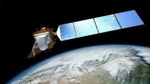
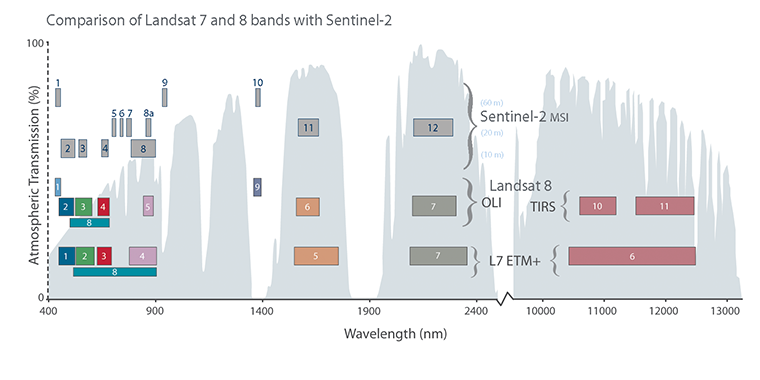
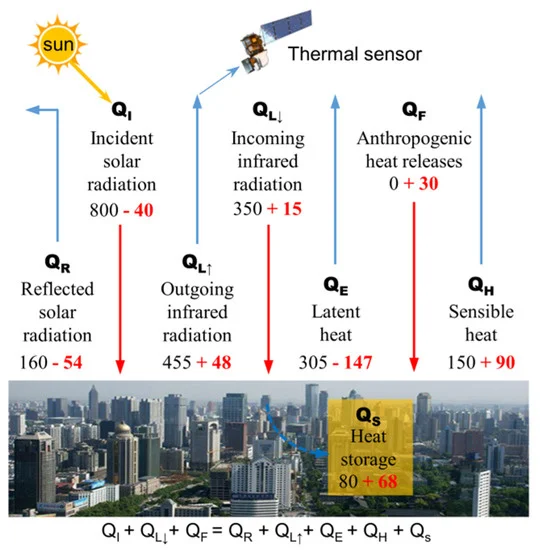
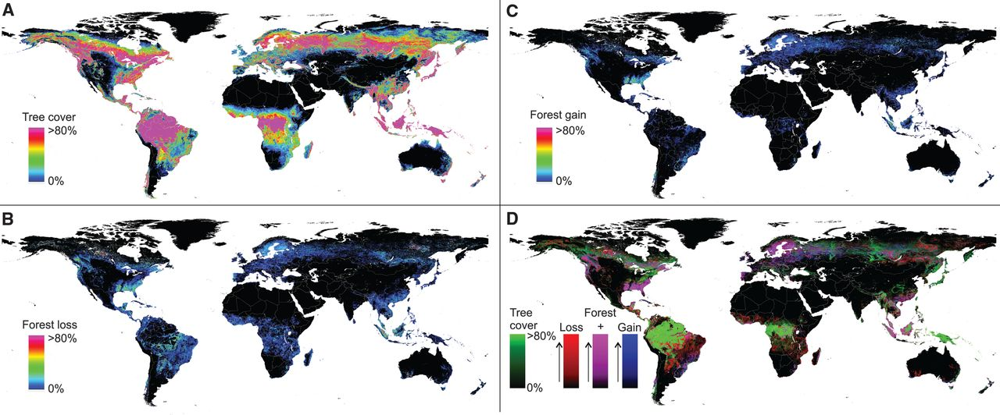

```{r setup, include=FALSE}
library(RefManageR)

# 设置引用选项
BibOptions(check.entries = FALSE,
           bib.style = "authoryear",
           cite.style = "authoryear",
           style = "markdown",
           hyperlink = TRUE,
           dashed = FALSE,
           no.print.fields=c("doi", "url", "urldate", "issn"))

# 读取 BibTeX 文件
myBib <- ReadBib("Bib.bib", check = FALSE)


library(knitcitations)
```
# Summary: Landsat 8 Overview

**The first Landsat satellite in the 21st century.**

.middle[
.pull-left[
- **Launched**: February 11, 2013
- **Operational Lifetime**: 12+ years (still active)
- **Orbit**: Sun-synchronous, 705 km altitude
- **Temporal Resolution**: 16-day repeat cycle
- **Spatial Resolution**: 15m - 100m (depending on band)
]

.pull-right[


*Landsat 8 in orbit (Source: USGS)*
]
]


---
# Summary: Sensor Specifications
## Two Main Sensors:
**Operational Land Imager (OLI)**
- 9 spectral bands (visible, NIR, SWIR)
- 30m spatial resolution (15m for panchromatic)
- Band 1-9

**Thermal Infrared Sensor (TIRS)**
- 2 thermal bands
- 100m spatial resolution
- Band 10-11
<div style="transform: scale(0.5); transform-origin: top left;">
  <table style="border-collapse: collapse; width: 100%; font-size: 12px;">
    <tr>
      <th>Band</th>
      <th>Name</th>
      <th>Wavelength (µm)</th>
      <th>Resolution (m)</th>
    </tr>
    <tr>
      <td>1</td>
      <td>Coastal Aerosol</td>
      <td>0.43 - 0.45</td>
      <td>30</td>
    </tr>
    <tr>
      <td>2</td>
      <td>Blue</td>
      <td>0.450 - 0.51</td>
      <td>30</td>
    </tr>
    <tr>
      <td>3</td>
      <td>Green</td>
      <td>0.53 - 0.59</td>
      <td>30</td>
    </tr>
    <tr>
      <td>4</td>
      <td>Red</td>
      <td>0.64 - 0.67</td>
      <td>30</td>
    </tr>
    <tr>
      <td>5</td>
      <td>Near-Infrared</td>
      <td>0.85 - 0.88</td>
      <td>30</td>
    </tr>
    <tr>
      <td>6</td>
      <td>SWIR 1</td>
      <td>1.57 - 1.65</td>
      <td>30</td>
    </tr>
    <tr>
      <td>7</td>
      <td>SWIR 2</td>
      <td>2.11 - 2.29</td>
      <td>30</td>
    </tr>
    <tr>
      <td>8</td>
      <td>Panchromatic (PAN)</td>
      <td>0.50 - 0.68</td>
      <td>15</td>
    </tr>
    <tr>
      <td>9</td>
      <td>Cirrus</td>
      <td>1.36 - 1.38</td>
      <td>30</td>
    </tr>
    <tr>
      <td>10</td>
      <td>TIRS 1</td>
      <td>10.6 - 11.19</td>
      <td>100</td>
    </tr>
    <tr>
      <td>11</td>
      <td>TIRS 2</td>
      <td>11.5 - 12.51</td>
      <td>100</td>
    </tr>
  </table>
</div>


---
# Summary: Key Improvements 
**Compared to Landsat 7, Landsat 8 has the following improvements**
- Enhanced Signal-to-Noise Ratio (SNR)
- 12-bit quantization (vs. 8-bit)
- No Scan Line Corrector issues
- New Coastal/Aerosol band
- Split thermal bands for better temperature measurements

.center[

]

---

# Applications: Urban Studies

Landsat 8 provides significant improvements for Surface Urban Heat Island (SUHI) research through its TIRS sensor. The dual thermal bands (10 and 11) enable more accurate Land Surface Temperature (LST) retrieval using the split-window algorithm, while its high radiometric resolution (12-bit) offers better thermal detail detection compared to previous Landsat missions (Zhou, 2019).

Landsat 8 has been extensively used in studying diurnal temperature variations, seasonal UHI patterns, and the relationship between land use changes and urban temperature. However, its 16-day revisit cycle limits the temporal analysis of rapid urban temperature changes.

<div class="center">
  
</div>


---
# Applications: Environmental Monitoring

## Forest Change Detection
Hansen et al. (2013) utilized Landsat 8 alongside Landsat 7 to create the first global, high-resolution maps of forest change. The study specifically leveraged Landsat 8's enhanced 12-bit radiometric resolution and improved signal-to-noise ratio to detect subtle changes in forest cover that were previously difficult to identify.

The research mapped global forest extent and change from 2000 to 2012 at 30-meter resolution, identifying approximately 2.3 million square kilometers of forest loss. Landsat 8's data continuity with previous Landsat missions was crucial for maintaining consistent long-term forest monitoring capabilities.

<div class="center">
  
</div>

---
# Reflection: Current Limitations

The Landsat 8 mission, despite its advanced capabilities, faces several practical challenges I discovered while working with its data. The 16-day revisit cycle means I could only access two images per month of my study area at best. When factoring in cloud cover, which often exceeds 60% in tropical regions like Southeast Asia, getting a clear image could take several months. I found this particularly frustrating when trying to monitor rapid forest changes or urban development.

Working with the 30-meter resolution data proved challenging in my urban analysis projects. When examining a single pixel in a dense urban area, it often contained a mix of buildings, roads, and vegetation, making it difficult to accurately classify land use. This issue became even more apparent when I attempted to detect small-scale urban changes or identify individual buildings. The need for specialized software like ENVI for processing the large data files (often exceeding 1GB per scene) and performing atmospheric corrections also created a significant barrier for many potential users, especially those in resource-limited settings.
---

# Reflection: Future Perspectives

Looking forward, I see tremendous potential in overcoming current limitations through technological advancement and integration. The emergence of machine learning and artificial intelligence promises to revolutionize how we process and analyze Landsat 8 data, enabling more efficient and automated analysis at global scales. Particularly exciting is the potential for combining Landsat data with other Earth observation sources, such as Sentinel-2 imagery and UAV data, which could address current temporal and spatial resolution limitations.

From a personal perspective, this study has highlighted the vital role of remote sensing in addressing global challenges. While I may not directly work with Landsat 8 in the future, understanding its capabilities and limitations has deepened my appreciation for Earth observation technologies. The skills and knowledge gained through studying this system will be invaluable for future work in environmental monitoring and policy development, particularly as we face increasing challenges from climate change and the need for sustainable resource management.

---
# References

  Hansen, M. C. et al. (2013) High-Resolution Global Maps of 21st-Century Forest Cover Change. Science (American Association for the Advancement of Science). [Online] 342 (6160), 850–853.


  Zhou, D. et al. (2019) Satellite remote sensing of surface urban heat islands: Progress, challenges, and perspectives. Remote sensing (Basel, Switzerland). [Online] 11 (1), 48-.


